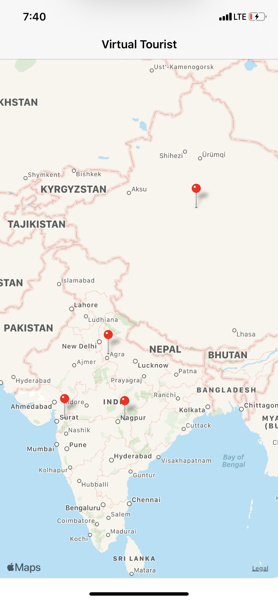

# Virtual Tourist

Virtual Tourist lets a user to mark locations on a map and clicking on an annotation opens a new view showing images of that place using Flickr API. User can delete or refresh the images of a particular pin. Both the pin and the photos are persisted offline.
 
* Swift
* Core Data
* UIKit
* MapKit
* Networking using API calls

## App Features

1. Marking user's favourite locations in a map and downloading the images of that location through Flickr API. The images are stored in a separate album for each pin.
2. Editing an album for a particular pin by deleting an image or fetching new images.

## Implementation
The app contains 2 View Controllers: 
1. TravelLocationsMapViewController - It has a MapView that lets a user to add pins on the map and the pins are persisted using core data.
2. PhotoAlbumViewController - It shows the photos of location associated with the pin in a CollectionView. All the photos are persisted using Core Data. User can tap on a photo to delete it or use the "NEW COLLECTION" button to fetch a new collection of photos.

## How to build/compile
1. Open "Virtual Tourist.xcodeproj" file.
2. Select appropriate simulator.
3. Click the run button or command + R to run the project.

## Requirements

1. Xcode 10.3
2. Swift 5

## APIs used 

1. https://www.flickr.com/services/api/

## Screenshots
   

## License
This code is free and open source and I have build this project for my Udacity submission.
